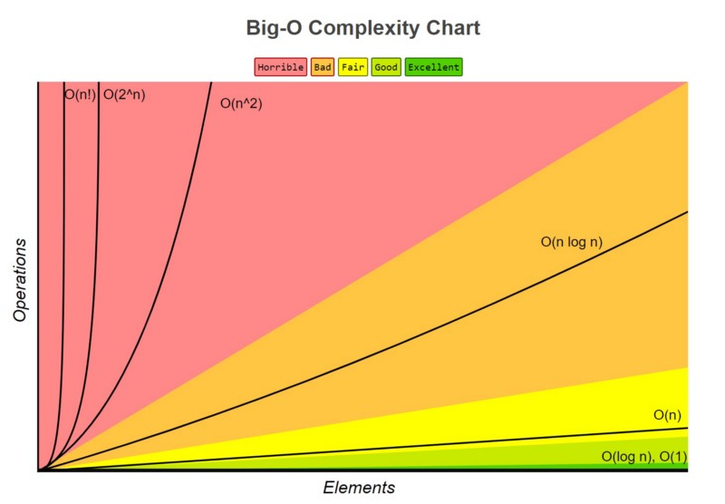

# 03: Introduction to Big O Notation

Como desarrollador, no solo debes preocuparte por escribir código que funcione, sino también por escribir código que **escale**. Cuando tus programas procesan 10 datos, casi cualquier solución es rápida; pero cuando procesan 1 millón de datos, una mala decisión de diseño puede congelar tu servidor o colapsar tu aplicación.

La notación **Big O** es la herramienta matemática que utilizamos en la industria para medir y comparar la eficiencia de nuestros algoritmos de forma estandarizada.

---

## 1. El problema de medir el código manualmente

Un error común al empezar es intentar medir la velocidad de un programa usando un cronómetro interno en el código (midiendo los segundos físicos que tarda en ejecutarse).

Esto no funciona en la vida real por tres razones principales:

- **Depende del Hardware:** El mismo código correrá mucho más rápido en una computadora de última generación que en un teléfono móvil antiguo.
- **Procesos en segundo plano:** Si tu computadora está actualizando el sistema o reproduciendo música mientras corres tu script, el tiempo de ejecución variará.
- **Diferencia de lenguajes:** Un mismo algoritmo lineal puede tardar tiempos físicos distintos si se ejecuta en Python, JavaScript o C++.

> 💡 **La solución de Big O:** En lugar de medir **segundos**, Big O mide el **número de operaciones matemáticas** que realiza la CPU en relación al tamaño de los datos de entrada (a los que llamamos de forma genérica **`n`**).

---

## 2. ¿Qué es Big O y el Peor Escenario?

La notación Big O describe el límite superior del crecimiento de un algoritmo. En la ingeniería de software, casi siempre nos enfocamos en el **peor de los escenarios (Worst-Case Scenario)**.

Imagina que tienes una función que busca una letra específica dentro de una palabra:

- **El mejor escenario:** La letra que buscas es la primera de la palabra. El bucle se ejecuta una sola vez.
- **El peor escenario:** La letra que buscas está al final de la palabra, o peor aún, **no existe** en la palabra. El bucle tiene que revisar absolutamente todas las letras.

Big O asume siempre ese peor caso. Esto nos da una **garantía de rendimiento**: sabemos con certeza que el programa nunca se comportará peor de lo que dicta su Big O.

---

## 3. Complejidad de Tiempo vs. Complejidad de Espacio

Un algoritmo eficiente debe balancear dos recursos del computador:

1. **Time Complexity (Complejidad de Tiempo):** Cuánto tiempo (operaciones de CPU) tarda el algoritmo en terminar a medida que los datos crecen.
2. **Space Complexity (Complejidad de Espacio):** Cuánta **memoria RAM adicional** necesita crear el algoritmo para resolver el problema a medida que los datos crecen.

_Nota crucial:_ Si tu función recibe un string de 1 millón de caracteres y tú creas un string duplicado dentro de la función para manipularlo, estás consumiendo memoria de forma proporcional al input, lo cual impacta el espacio.

---

## 4. El Espectro de Eficiencia

Para entender Big O, clasificamos los algoritmos en diferentes niveles de eficiencia (de mejor a peor):

| Notación  | Nombre     | Eficiencia        | Descripción                                                                                           |
| :-------: | :--------- | :---------------- | :---------------------------------------------------------------------------------------------------- |
| **O(1)**  | Constante  | Excelente         | El número de operaciones no cambia, sin importar el tamaño de los datos.                              |
| **O(n)**  | Lineal     | Bueno / Aceptable | El número de operaciones crece de forma directa y proporcional al tamaño de los datos.                |
| **O(n²)** | Cuadrático | Peligroso / Malo  | El número de operaciones crece exponencialmente (común en bucles anidados). Evítalo si `n` es grande. |



---

## 5. Las Reglas de Oro de Big O

Para calcular el Big O de tu código de manera rápida y sin matemáticas complejas, sigue estas dos reglas de simplificación:

### Regla 1: Ignora las constantes

A Big O solo le interesa la tendencia de crecimiento a gran escala. Operaciones que se ejecuten una cantidad fija de veces no alteran la curva de crecimiento cuando `n` tiende a millones.

- `O(2n)` se simplifica a **`O(n)`**
- `O(500)` se simplifica a **`O(1)`**

### Regla 2: Quédate con el término dominante

Si tu algoritmo realiza diferentes tipos de operaciones, elimina los componentes que crezcan más lento y conserva únicamente el peor de ellos.

- `O(n² + n + 5)` se simplifica a **`O(n²)`** (porque a gran escala, `n²` aplasta por completo el crecimiento de `n` y `5`).

---

## 6. Ejemplos Prácticos en Python

Miremos cómo se traducen estas notaciones directamente en código real de Python:

### Ejemplo 1: Complejidad Constante - O(1)

No importa si el texto tiene 5 letras o 10 millones, esta función siempre realiza exactamente una sola operación para recuperar el elemento.

```python
def get_first_character(text):
    # Time Complexity: O(1) - Operación constante directa
    # Space Complexity: O(1) - No se crea memoria adicional
    return text[0]
```

### Ejemplo 2: Complejidad Lineal - O(n)

Si el string text mide 10 caracteres, el ciclo se ejecuta 10 veces. Si mide 1 millón, se ejecuta 1 millón de veces.

```python
def print_each_character(text):
    # Time Complexity: O(n) - Crece proporcional al tamaño del texto
    # Space Complexity: O(1) - Solo usamos la variable temporal char
    for char in text:
        print(char)
```

### Ejemplo 3: Complejidad Cuadrática - O(n²)

Por cada carácter del string, volvemos a recorrer el string completo. Si la palabra mide 4 caracteres, el código realiza $4 \times 4 = 16$ impresiones. Si mide 1000, realiza 1,000,000 de operaciones.

```python
def print_all_combinations(text):
    # Time Complexity: O(n^2) - Bucles anidados independientes sobre el mismo input
    # Space Complexity: O(1) - No se genera nueva estructura de datos
    for char1 in text:
        for char2 in text:
            print(f"{char1} and {char2}")
```

## Quiz: Calcula el Big O (Time Complexity)

Analiza el peor escenario de los siguientes bloques de código y calcula su Big O final aplicando las reglas de simplificación.

### Pregunta 1: Los ciclos independientes

```python
def process_data(text):
    print(text[0])

    for char in text:
        print(char)

    for char in text:
        print(char)
```

<details>
<summary>💡 Ver Solución</summary>

- **Respuesta:** `O(n)`

**Explicación:** La primera línea es `O(1)`. Luego tenemos dos ciclos `for` independientes consecutivos, lo que da `O(n) + O(n) = O(2n)`. Sumando todo nos da `O(1 + 2n)`. Aplicando las reglas de simplificación, eliminamos la constante `1` y el multiplicador `2`, dejándonos con un Big O final de `O(n)`.

</details>

### Pregunta 2: El filtro estricto

```python
def secret_scanner(text):
    for char in text:
        if char == "z":
            print("Found the secret!")
            return True
    return False
```

<details>
<summary>💡 Ver Solución</summary>

- **Respuesta:** `O(n)`

**Explicación:** Recuerda que `Big O` mide el peor escenario. Si la letra `"z"` está en la primera posición, sería `O(1)`. Pero en el peor de los casos, la `"z"` no existe en el texto, obligando al bucle `for` a recorrer toda la cadena de longitud `n`. Por lo tanto, su complejidad garantizada es lineal: `O(n)`.

</details>

### Pregunta 3: El ciclo de rango fijo

```python
def fixed_repetition(text):
    for i in range(100):
        print(text[0])
```

<details>
<summary>💡 Ver Solución</summary>

- **Respuesta:** `O(1)`

**Explicación:** Aunque hay un ciclo `for`, este no depende del tamaño de la variable `text`. Sin importar si el texto tiene 10 letras o 10 millones, el ciclo siempre se ejecutará exactamente 100 veces. Al ser una cantidad de operaciones fija y constante, se simplifica a `O(1)`.

</details>
